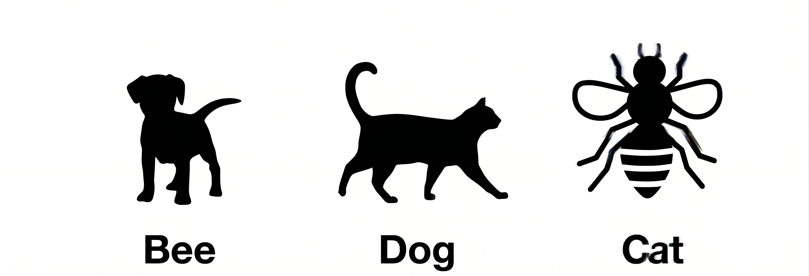

In my ongoing work blending systematic logical frameworks with esoteric philosophy, I continually return to the teachings of Paul Foster Case. Case defines concentration as the unwavering fixation of attention upon a single point or symbol. Meditation, in his system, is the unbroken flow of consciousness that logically follows. It is a state where my mind merges with the object, penetrating far beyond its superficial imagery to grasp its inner, esoteric reality.

However, a practical hurdle frequently arises for those studying Case's methods: how exactly does one transition from staring at a symbol to experiencing that continuous, revelatory flow of knowledge? I have found that the answer lies in understanding the precise mechanics of perception and abstraction. To decode this, I look to two seemingly disparate fields that seamlessly overlap with esoteric practice: the psychological engineering of Psychonetics and the mathematical philosophy of Kurt Gödel.

Psychonetics originated in the 1980s from academic and state-sponsored research conducted at the Kiev Institute of Psychology in the USSR. A team of researchers, including scientist Oleg Bakhtiyarov, was tasked with developing practical psychological techniques to help cosmonauts, military special forces, and nuclear power plant operators maintain self-control and peak performance in extreme situations or altered states of consciousness. To accomplish this, the research team studied a wide array of mind-affecting practices—ranging from hypnosis and biofeedback to traditional Buddhist, yogic, and mystic texts. Their primary breakthrough was meticulously stripping away the religious, mystic, and ideological biases from these traditional practices, extracting only the working mechanics. The result was the birth of Psychonetics: an agnostic, technological toolset of pure psychotechnologies designed to access human mental and perceptual resources in a pragmatic and highly reproducible manner.

## Folding the Symbol: The Psychonetic Approach

In the discipline of Psychonetics, there is a core concept known as "Pure Meanings." A pure meaning is the raw, unarticulated essence of a thought, completely devoid of words, visual imagery, or sensory simulation. It is the dimensionless sensation of *knowing* something intrinsically, much like the wordless intuition I experience when I suddenly grasp the architecture of a complex piece of software or a profound symbolic system.

To reach this state, Psychonetics utilizes an operation called "folding." If I want to fold an entity I must intentionally strip away my sensory perception and verbal labels. I isolate the pure meaning sensation directly.

I do not meditate *on* the imagery of the Tarot card; rather, I concentrate on it to gather its boundaries, and then I *fold* it. I de-verbalize and de-visualize the symbol in my mind until only its pure, abstract, semantic quality remains.

Imagine having a concept on the tip of your tongue: you know exactly what it means and you intuitively grasp its profound essence, but the words to express it simply refuse to emerge. This sensation of naked knowing, in the total absence of language or visual imagery, is a spontaneous experience of a *pure meaning*. To replicate this voluntarily using psychonetics, try thinking of a green triangle. If you intentionally strip away the mental image of the shape, the color, and the word itself, that abstract, dimensionless mental residue that remains is the pure meaning of the concept.

Another way to get in touch with pure meanings is the following one:

> "A slightly jarring but effective way to notice the mental layer where pure meanings exist is by exposing it to contradictory sensory input. Such input often triggers a strong rejection reaction, which provides an opportunity to consciously observe the place where the rejection comes from.
>
> The practitioner briefly observes the provided images and notices the sensation of rejection they evoke."
>
> — **Igor Kusakov**, *Psychonetics* (p. 66)

## Gödel and the Intuition of the Abstract

Kurt Gödel, through the profound implications of his incompleteness theorems, proved that mechanical, purely formal systems cannot capture all truths. He argued compellingly that the human mind possesses a unique capacity: the direct intuition or "perception" of abstract concepts.

Gödel maintained that understanding profound truths requires moving past the physical symbols on a page. He insisted that I must reflect upon the *meanings* involved, rather than the combinatorial properties of the concrete symbols themselves. Gödel called this "meaning clarification"—concentrating intensely on the concepts to produce a new state of consciousness that perceives invariant realities.

He recognized that the mind is not a static machine. It develops, understanding abstract terms more precisely as it interacts with them. This is the exact mechanism of esoteric revelation that Case describes. The symbol is merely the formal system; the intuition of the abstract concept is the revelation.

The technique suggested by Gödel for gaining knowledge of abstract ideas is based on "meaning clarification," a phenomenologically derived method that goes beyond the mere mechanical manipulation of graphic symbols. This technique consists of concentrating intensely on concepts by directing attention not toward concrete signs, but toward our own cognitive acts and the mental faculties aimed at their use. Through this reflective examination, and by utilizing related tools such as "free variation in imagination"—which is the act of freely varying a mental instance to trace its constant structural limits—the mind is able to isolate the essential and invariant properties of a concept. For Gödel, this exercise is not a static process, but an activity of continuous development capable of generating a new state of consciousness that can directly perceive the objectivity and inexhaustibility of pure ideas.

## Establishing a Continuous Flow of Knowledge

How do I apply this synthesis practically to establish a continuous flow of knowledge regarding these Pure Meanings? I break it down into a precise protocol:

1. I fix my attention strictly on the chosen symbol or concept. This maps the parameters and loads the symbolic data into my conscious awareness.
2. I then intentionally drop the visual and verbal framework. I stop seeing the painted image and stop reciting the associated names. I reach for the Gödelian intuition, the abstract, objective essence that the symbol was originally engineered to represent. I isolate the dimensionless sensation of the concept.
3. Having folded the symbol into a Pure Meaning, my consciousness enters the abstract space. I do not think *about* the object using serial, verbal logic; instead, I sustain my directedness toward the invariant concept. Because this pure meaning is independent of my subjective, changing ideas, it acts as a stable node in the mental space.

By anchoring my mind in the pure meaning rather than the sensory symbol, I bypass the limitations of mechanical thought. The knowledge that flows from this state is not a series of deduced facts, but a holistic, dimensional apprehension of truth. It allows me to institute a continuous flow of realization, providing a direct, unmediated interface with the archetypal source that Case intended for his students to reach.
