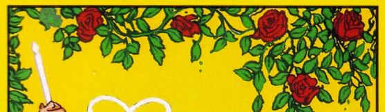
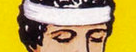
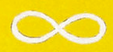
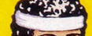
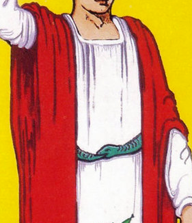
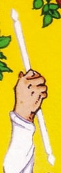
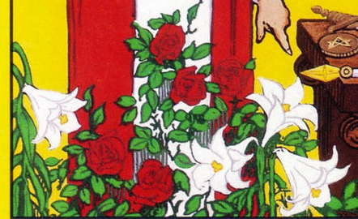
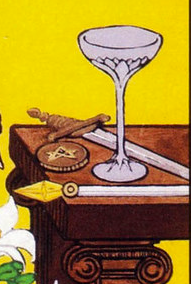

I wanted to share some thoughts and a detailed meditation I’ve been working on regarding Key 1. I’ve come to view it as a highly practical, step-by-step operational manual for manifesting our desires into material reality. 

By closely observing the specific elements and symbols of the card, we can extract the foundational steps required to materialize what we will. 

## The Roses Above

At the top of the card, we see an arbor of red roses, which represent our desires. Notice there are exactly 5 of them, corresponding to our 5 physical senses. Their placement in the upper canopy of the card, suspended above and away from the physical body, indicates that the use of these 5 senses must first occur on another, subtler plane. 

The rose is the flower of Venus, and we know Venus is intimately connected to Key 3, The Empress (Creative Imagination). This tells us that the absolute foundation of the operation consists of vividly imagining a scene, actively engaging all 5 senses. It is not enough to hold a static, abstract image; you must feel the texture, hear the specific sounds, and even smell the fragrance of your desired outcome. 

Venus represents the magnetic, attractive force of emotion that pulls the unformed into physical form. Let us recall for a moment how Venus was born in Greek mythology, looking at **The Birth of Venus, by Botticelli**. Cronus (Saturn) cut off Uranus' phallus and threw it into the sea. From the seed of the severed phallus, Venus was born from the waters. As you can see from the image, as soon as Venus emerges from the waters, Zephyr (a version of Ruach) appears to support her with the Life Force (giving life to the image) and a female figure appears who immediately tries to dress her (giving body to the image).

These same roses appear in Key 8, where, woven into a garland, they represent the chain of sensory-rich suggestions used to bind and direct the animal nature of the Subconscious.

## The Closed Eyes

The Magician’s operation is entirely internal. By closing his eyes (or disengaging physical sight), he is actively and consciously renouncing the deception of The Devil (Key 15), who insists that "only what is seen physically exists" and that we are bound by our current circumstances. 

Closing his eyes means refusing to give credit to outward physical appearances or temporary limitations. There is also a profound physiological secret to manifestation hidden here: the "alpha state." When we close our eyes and withdraw from the external world, the brain triggers a series of mechanisms to enter a meditative state characterized by a predominance of alpha brainwaves. This relaxed yet alert state is the ideal, fertile soil for bypassing the critical faculty and reprogramming the subconscious mind. 

> Recent studies confirm that simply closing the eyes naturally induces this receptive alpha state.

## The Lemniscate

Hovering above the Magician’s head is the horizontal figure eight, the symbol of infinity and the Holy Spirit. The number 8 is directly linked to Key 8, indicating the Law of Suggestion. Furthermore, the infinity symbol represents a continuous, rhythmic loop. This is a direct, practical instruction regarding the "chain of suggestions": **Repeat your carefully selected, sensory-rich scene on a loop in your imagination.** 

The subconscious mind learns and is molded through rhythmic repetition. A fleeting thought of desire is not enough; it is the rhythmic, repetitive impressing of the image that carves a deep groove into the astral substance, compelling the subconscious to act upon it.

## The White Headband

The band encircling his forehead represents an enclosure, a boundary, a protective perimeter. The Magician has consciously chosen exactly what he wants to achieve, and he has done so by deliberately circumscribing his field of attention, locking out ignorance and distractions. 

The white band indicates the absolute silence of random, contradictory thoughts and a single-pointed focus on one object. To manifest successfully, you must eliminate conflicting ideas. Yet, holding a single mental image steady is notoriously difficult because the untrained mind naturally tends to wander. To assist the imagination in maintaining this strict boundary, occultists employ spoken words and physical rituals. 

In the Qabalistic tradition, this concept of a literal "fence" or enclosure is tied directly to the Hebrew letter Cheth, whose corresponding function is Speech. **Words are the ultimate fence.** Precise words create sharp, unmistakable boundaries for your mental scene. Therefore, do not limit yourself to vaguely thinking about what you want; you must actively translate your desire into a short, highly defined, and concise sentence. 

## The Red Tunic

This vibrant mantle reveals a beautiful paradox: even though the Magician appears physically still and deeply concentrated, he is a center of immense, vibrant activity. Red is the color of Mars, representing dynamic action, vitality, and passion. Yet, he wears this active red over a pure white undergarment (representing Kether and pure spiritual motive). The very silencing of his outward personality and the purification of his inner motives are what transform him into an unobstructed, highly active channel for the Life Power to rush through.

## The White Wand

Raised toward heaven, the white wand shows that the Magician draws his Force from above, from the Superconscious plane, not from his own personal ego. Concentration is simply the focusing of units of Life Power. This vital energy, drawn down by the Magician's focused attention, is what will vivify and breathe life into the mental molds of his desire. 

This is a tremendous relief: you do not have to force the manifestation to happen through sheer personal willpower. You simply provide the focus, and the Superconscious provides the boundless power.

## The Garden

The garden at his feet represents the Subconscious mind. The Subconscious is entirely impersonal. It is fertile soil that will grow weeds of fear just as efficiently as it grows the roses of desire if we let our attention wander. 

The Life Power, channeled by the Magician's wand, provides the solar light needed for this garden to flourish according to the seeds he has planted. We see it giving life to both lilies and roses. Notice the hermetic axiom "As above, so below" in action: the desires Above (the 5 roses in the canopy) are mirrored below, where 5 corresponding roses bloom in the physical world. 

## The Tools on the Table

These are the four elementary weapons, the mental tools required to achieve perfect, balanced manifestation on the physical plane:

### The Wand
First, you must have a clearly defined intention and Will. This is the initial spark that initiates the entire process.

### The Sword
Next, you must use intellect and analysis to investigate that desire. Slice away any societal conditioning or false ego-drives. Ask yourself: Is this desire purely selfish, or does it contribute in some way to the greater good? Furthermore, have you done everything in your current physical power regarding this matter? 

### The Cup
This is the emotional Receptivity and Imagination. Through it, we create the structural mold that will receive the energy needed for manifestation. You must cultivate the deep feeling of the *wish fulfilled*. The inner scene you created receives the emotional force necessary to become a fully-fledged thought-form, gestating and waiting to manifest at the proper moment.

### The Coin
The material counterpart and physical action. You must, in some way, signal on the physical plane that you are aligned with your desire and expect its arrival. Some call this phase "digging the ditches." 

> "Dig ditches all over this valley. Here’s what will happen—you won’t hear the wind, you won’t see the rain, but this valley is going to fill up with water and your army and your animals will drink their fill. This is easy for GOD to do"
> **(2 Kings 3:16-17)**

You must perform tangible, material actions that testify to your faith and readiness to receive.

**In L.V.X.**
